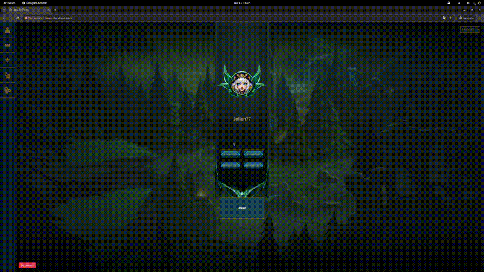
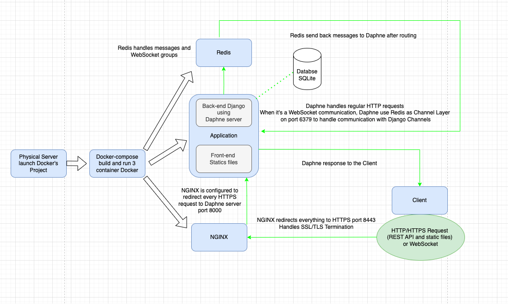

# Transcendance - Web Project 🏓☄️🔥📚

Transcendance project is our first Web project. It aims to develop a single page application (SPA) inspired by the famous Pong game.

## 📋 Contents

- [Technical Stack](#-technical-stack)
- [Key Features](#-key-features)
- [Installation Configuration](#-installation-configuration)
- [Architecture](#-architecture)
- [Tests](#-tests)
- [Contributors](#-contributors)


## 🛢️ Technical Stack  

Back-end  : Python / Django / Django REST Framework  
Front-end : HTML / CSS / Bootstrap / Javascript

Blockchain feature : Solidity / Node.js / Hardhat / Alchemy  => [MyFirstHardhatProject](https://github.com/BdClement/MyFirstHardhatProject)
 
Database : SQLite (Django default's Database)

Django REST Framework is used to build an API REST to allow communication between back-end and front-end. This API enables CRUD operations and JSON data transfer in a fluid way.


## 👨‍💻 Key Features  

Authentification and user management :  
A user can register, login and logout in a secure way. A user can update his information and upload an avatar. A friend system has been developed allowing users to follow/unfollow users.  


Multi-languages :  
A language selector is available to change it anytime. A user has a favorite language (French by default) and can change it whenever they  want. The 3 languages available are French, English and Viet.  


Tournament :  
A user can create a tournament with a registration system with alias_names related to subscribed users.  
A clear display shows which players will play next. 

Blockchain :  
At the end of a tournament, the score is stored on Sepolia Ethereum Testnet from the server. A display informs the user with a link to Etherscan to check the transaction when it is completed.  


Remote player :  
A user can create or join a distant play. It starts when all the players are connected.  

Multi-player :  
A user can create a remote or local 2v2 play. This play is fluid and in real-time for both players.  

Back-end side game and API :  
The game logic has been developped in Python on server side. An API has allowed the game initialization, player controls, and game state updates.  





## 🔧 Installation Configuration  

To launch the project, you will need a .env file similar to this example : 
```plaintext
    ALCHEMY_RPC=your_alchemy_rpc
    PUBLIC_KEY=your_public_key
    PRIVATE_KEY=your_private_key
    CONTRACT_ADDRESS=your_contract_address
```
This env file which must be stored in srcs/ folder, allows blockchain functionnality. For security, reasons, you won't have access to those variables and won't be abble to make blockchain functionnality works.

You will need to place SSL certificate and private_key to nginx folder. To do so, you can run this command :  
```bash
openssl req -x509 -newkey rsa:4096 -keyout private.key -out certificate.crt -days 365 -nodes
mv private.key srcs/nginx/
mv certificate.crt srcs/nginx/
```


## 🏗 Architecture  



We used NGINX as a proxy. It has been configured to redirect every incoming conneciton to HTTPS port.  
It handles the TLS/SSL termination, which involves decrypting incoming HTTPS requests, verifying SSL certificates, and ensuring secure communication.  
It redirects to Daphne on port 8000.

We used Daphne as a server and not Django default's server, which is WSGI server, because it supports asynchronous communication (ASGI).  
Daphne handles regular requests and WebSockets via Django Channels.

We used Redis as the central message broker, managing message routing between multiple consumers (game participants). It handles WebSocket group memberships and distributes messages to consumers in the same group.
Once a message is routed by Redis to the relevant group, Daphne retrieves it and sends it to the connected WebSocket clients in real-time, ensuring that all players receive the updates.

This architecture ensures efficient communication between players in the game, with Redis allowing for scalable message routing and Daphne ensuring real-time delivery.

## 🧪 Tests  
The project has been an introduction to unit tests and integration tests using Django's built-in testing framework.    
To run the tests, use the command to access app container :

```bash
docker exec -it django-app bash
```
And run this commande to execute tests :
```bash
python manage.py test
```

## 💼 Contributors  
- [Julien Degluaire](https://github.com/Juliendeg)
- [Ilona Selbonne](https://github.com/slbilona)
- [Bastien Mirlicourtois](https://github.com/bmirlico)
